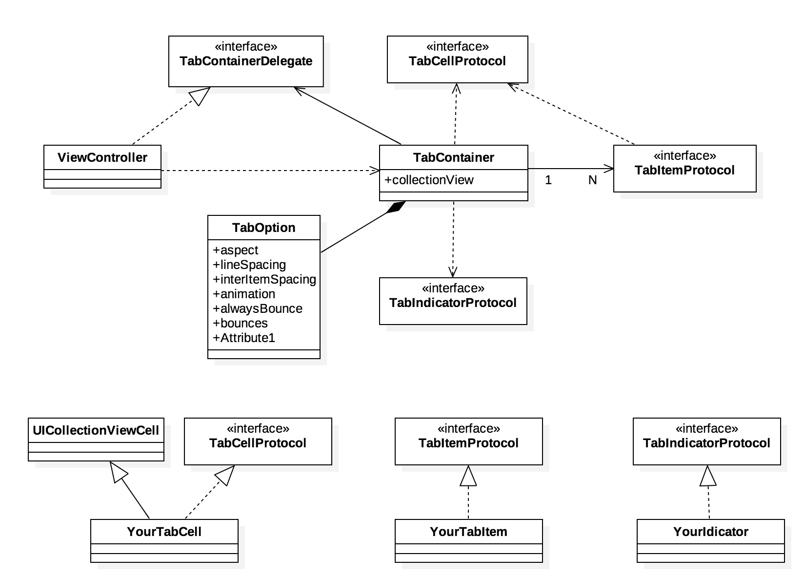

# PGTabBar

[](https://travis-ci.org/damon.park/PGTabBar)
[](http://cocoapods.org/pods/PGTabBar)
[](http://cocoapods.org/pods/PGTabBar)
[](http://cocoapods.org/pods/PGTabBar)

It simply provide TabContianer & protocols (tabcell, tabitem, tabindicator).

You can customize tabcell, tabitem, tabindicator with protocols.



## Example

To run the example project, clone the repo, and run `pod install` from the Example directory first.

appetize.io demo : [\[ here \]](https://appetize.io/embed/14epxbmgw66abnmx3534nehzmg?device=iphone5s&scale=75&orientation=portrait&osVersion=9.3)

## Requirements

- above ios 8.0
- swift 3.0
- with cocoapods

## Installation

PGTabBar is available through [CocoaPods](http://cocoapods.org). To install
it, simply add the following line to your Podfile:

```ruby
pod "PGTabBar"
```

## Author

iPagong, ipagong.dev@gmail.com

## License

PGTabBar is available under the MIT license. See the LICENSE file for more info.
